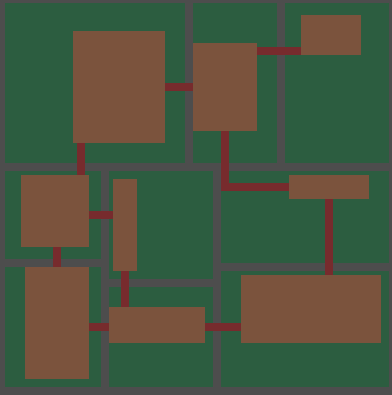

# Binary Space Partitioning in Godot 4 C#
This repo contains a runnable Godot project that generates dungeons using the Binary Space Partitioning (BSP) algorithm.
It is used in my game, Tombs of Telleran, and is a companion repository to [this blog post](https://stonesigil.com/blog/bsp-roguelike-csharp/) where I explain the algorithm.

I hope you find it useful! If you have questions you can get in touch with me in the issues or on [bluesky](https://bsky.app/profile/stonesigil.bsky.social).

# Example Output

# Running the project
Simply clone the repo, open it using Godot (tested on 4.3), and run the main scene.
Parameters for the dungeon generation can be tweaked on the `Config` node in `Main.tscn`.